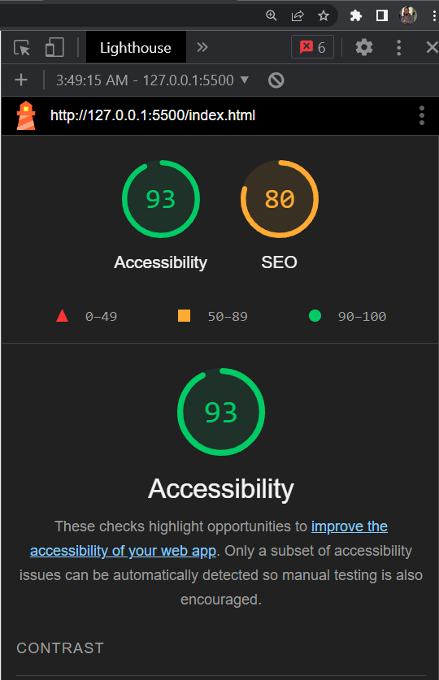

# LAB - 06

## Cookie Stand

### Author: Lavieng Chanthabandith

### Links and Resources

[Random Numbers in JavaScript](https://www.youtube.com/watch?v=1Rq_LrpcgIM)

[JavaScript Functions](https://www.w3schools.com/js/js_functions.asp)

[JavaScript Arrays](https://www.w3schools.com/js/js_arrays.asp)

[The For Loop in Java](https://www.youtube.com/watch?v=GwcisLY5avc)

[Math.floor()](https://developer.mozilla.org/en-US/docs/Web/JavaScript/Reference/Global_Objects/Math/floor)

[Array.prototype.push()](https://developer.mozilla.org/en-US/docs/Web/JavaScript/Reference/Global_Objects/Array/push)

[Call Stack](https://developer.mozilla.org/en-US/docs/Glossary/Call_stack)

[Node: appendChild() method](https://developer.mozilla.org/en-US/docs/Web/API/Node/appendChild)

[Formatting a Page](https://www.youtube.com/watch?v=dVvifZurBcY)

[HTML-Tutorial-6](https://www.youtube.com/watch?v=60YKxDgAZig)

[Table in HTML and CSS](https://www.youtube.com/watch?v=dK27jWKtJxs)

[:nth-child()](https://developer.mozilla.org/en-US/docs/Web/CSS/:nth-child)

[Custom Fonts](https://www.youtube.com/watch?v=qgmLDPLApBY)

[JavaScript](https://www.youtube.com/watch?v=ndzAGJin2ZE)

[How to Create Table From an Array of Objects in JavaScript](https://www.youtube.com/watch?v=Wcr_bbMm3J0)

[render()](https://legacy.reactjs.org/docs/react-component.html#render)

[Image Gallery Using HTML](https://www.makeuseof.com/image-gallery-html-css-javascript/)

### Lighthouse Accessibility Report Score
